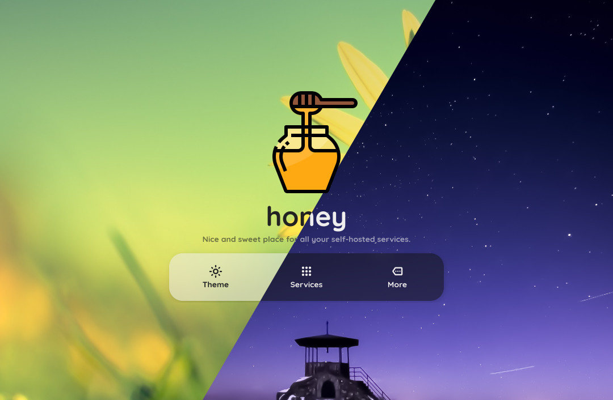

# honey

A sweet dashboard hosted on my homeserver with some self-hosted stuff...

Please also check the **[Live demo](https://dani3l0.github.io/honey)**!

# Installation
Works out of the box. Just put those files at the webroot of your server and then tweak the `config.json` file located in `config` directory!

honey is written in **pure** `HTML` `CSS` `JS` so dynamic backend is not required. All operations are done client-side.

## Configuration

Default `config.json` file is pretty readable, so you shouldn't have trouble with customizing it.

### Tweaking the user interface

The following keys are available under `ui` section

| Key name           | Description                                                                   |
|--------------------|-------------------------------------------------------------------------------|
| `name`             | Name shown at the main screen and the tab title.                              |
| `desc`             | Short description shown under title at the main screen.                       |
| `icon`             | Icon shown at the main screen and as site's favicon.                          |
| `wallpaper`        | Background image visible when dark mode is disabled.                          |
| `wallpaper_dark`   | Background image visible when dark mode is enabled.                           |
| `dark_mode`        | Tells whether dark mode is enabled by default.                                |
| `open_new_tab`     | Tells whether clicking on a service will open it in new tab (by default).     |
| `blur`             | Tells whether card background blur is enabled by default.                     |
| `animations`       | Tells whether UI animations are enabled by default.                           |
| `hosted_by`        | Short note who's hosting listed services. Visible in `Overview` tab. Settng `null` hides it. |

### Adding custom services

`services` section is an array containing objects.

| Key name           | Description                                                                   |
|--------------------|-------------------------------------------------------------------------------|
| `name`             | Your service's name.                                                          |
| `desc`             | Short description shown under service's name.                                 |
| `href`             | HTTP address of your service. It is directly passed to `<a>` tag.             |
| `icon`             | Path to an icon of your service.                                              |
